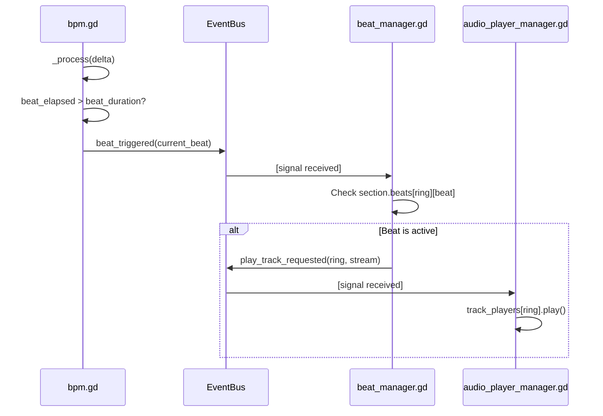
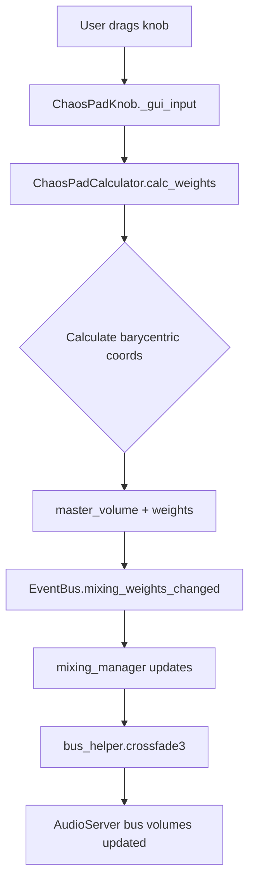
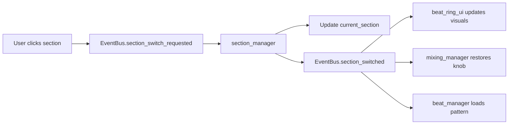

# 🏗️ YouBeatAI Architecture

## 🎯 Design Philosophy

YouBeatAI follows a **pure event-driven architecture** where:
1. **No direct coupling** between managers
2. All communication via `EventBus` signals
3. Shared state read from `GameState` singleton
4. Managers are independently testable

---

## 📊 System Flowcharts

### Beat Playback Flow



### Chaos Pad Mixing Flow



### Section Switching Flow



---

## 🔌 Manager Reference

### Core Systems

| Manager | Responsibility | Key Signals |
|---------|---------------|-------------|
| `bpm.gd` | Master clock, timing | `beat_triggered`, `bpm_changed` |
| `beat_manager.gd` | Sequencer logic | `clap_triggered`, `beat_state_changed` |
| `section_manager.gd` | Pattern storage | `section_switched`, `section_added` |
| `audio_player_manager.gd` | Audio playback | Listens to `play_track_requested` |
| `mixing_manager.gd` | Volume routing | Listens to `mixing_weights_changed` |

### Audio Chain

```
AudioStreamPlayer (track_players)
    ↓
Sample Track Bus (Dry/Alt1/Alt2)
    ↓
SubMaster Bus (per-track mixing)
    ↓
Master Bus (final output)
```

---

## 📁 File Organization Principles

1. **Managers** = Logic (no UI references)
2. **UI/** = Visual controllers (can reference managers via EventBus)
3. **DataClasses/** = Pure data (no scene tree dependencies)
4. **Core/Global/** = Autoloads only

---

## 🧩 Adding a New Feature

Example: **Add a "Shuffle Section" button**

### 1. Add EventBus Signal
```gdscript
# Scripts/Global/event_bus.gd
signal section_shuffle_requested()
```

### 2. Create UI Button
```gdscript
# Scripts/UI/shuffle_button.gd
extends Button

func _pressed() -> void:
    EventBus.section_shuffle_requested.emit()
```

### 3. Handle in Manager
```gdscript
# Scripts/Managers/section_manager.gd
func _ready() -> void:
    EventBus.section_shuffle_requested.connect(_shuffle_current_section)

func _shuffle_current_section() -> void:
    for ring in range(4):
        for beat in range(beats_amount):
            current_section.set_beat(ring, beat, randf() > 0.5)
    EventBus.section_changed.emit(current_section)  # Notify others
```

### 4. Test
```gdscript
# tests/integration/test_section_shuffle.gd
func test_shuffle_changes_beats():
    var original_state = current_section.copy()
    EventBus.section_shuffle_requested.emit()
    await get_tree().process_frame
    assert_ne(current_section.beats, original_state.beats)
```

---

## 🚨 Common Pitfalls

| ❌ Don't                                          | ✅ Do                                  |
| ------------------------------------------------ | ------------------------------------- |
| `get_node("%Manager").do_thing()`                | `EventBus.thing_requested.emit()`     |
| Store state in UI nodes                          | Store in `GameState` or `SectionData` |
| Use `await get_tree().process_frame` in managers | Use signals for async flow            |
| Hardcode paths: `load("res://...")`              | Use `@export var resource: Resource`  |

---

**See Also:**
- [STYLE_GUIDE.md](STYLE_GUIDE.md) — Code conventions
- [CONTRIBUTING.md](CONTRIBUTING.md) — How to contribute