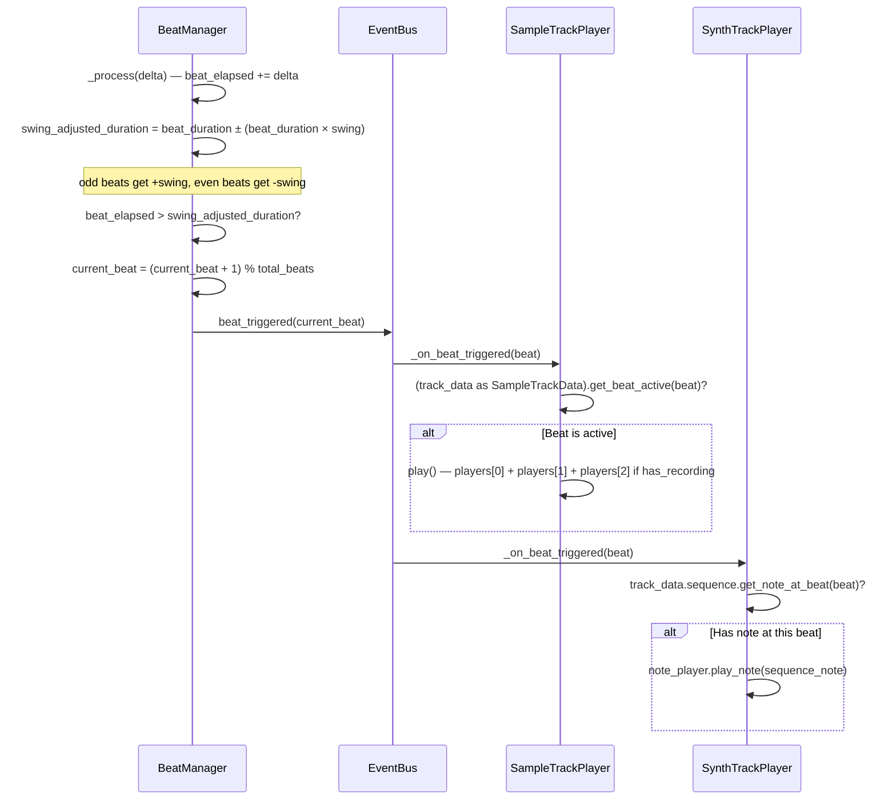
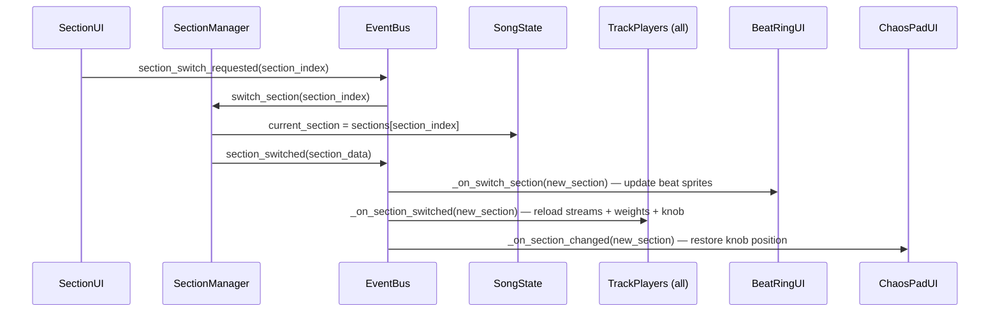
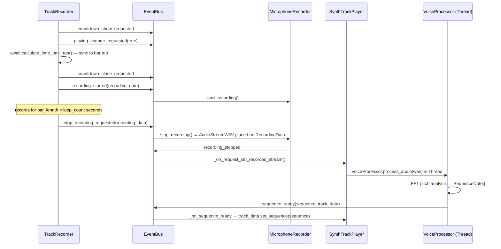
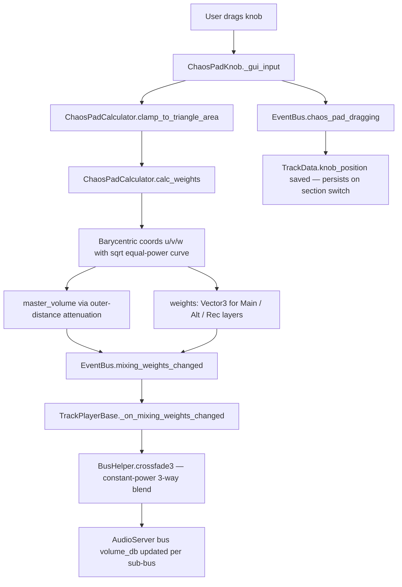
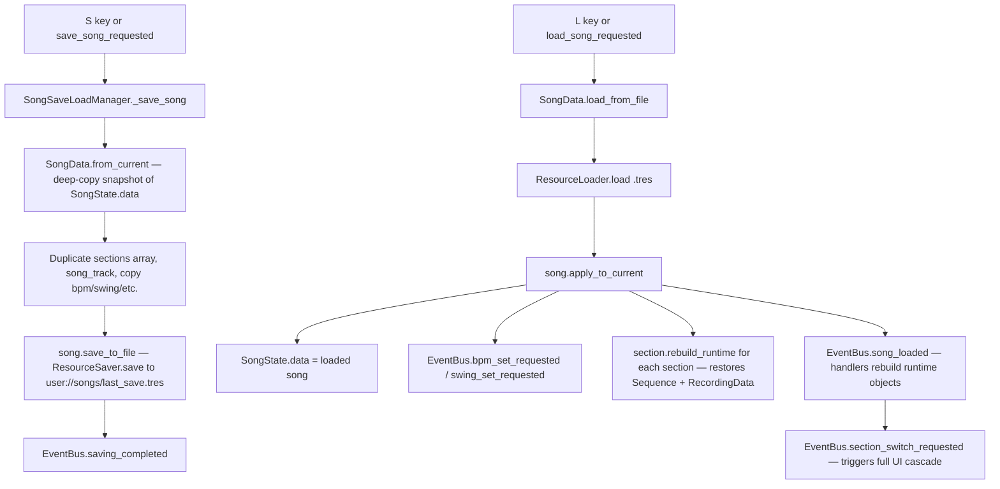

# 🏗️ YouBeatAI Architecture

## 🎯 Design Philosophy

YouBeatAI (also known as "Ritme Robot") is a Godot 4.6 music-creation app where Dutch children (~10 years old) build drum beats, record voice samples, and compose multi-section songs using a visual beat-ring interface and an AI robot companion called "Klappy".

The project follows a **pure event-driven architecture**:

1. **No direct coupling** between managers — they never hold references to each other
2. All inter-system communication flows through the `EventBus` autoload (signals only)
3. Persistent song state lives in `SongState`; ephemeral playback state lives in `GameState`
4. Every data class extends `Resource` so the full song tree is serializable to `.tres`
5. Managers are independently testable and replaceable
6. Static typing is mandatory everywhere — errors are caught at edit-time

---

## 📦 Project Structure

```
project root
├── Scripts/
│   ├── Global/           # Autoload singletons (EventBus, GameState, SongState, TTSHelper)
│   ├── Managers/         # Core game logic nodes (BeatManager, SectionManager, …)
│   ├── Audio/            # Playback, recording, microphone, waveform visuals
│   │   └── AudioPlayerClasses/  # TrackPlayerBase, SampleTrackPlayer, SynthTrackPlayer, SongTrackPlayer
│   ├── DataClasses/      # Pure serializable Resource classes
│   │   ├── SoundBanks/       # SoundBank, EffectProfile, NotePlayerSettings
│   │   └── TrackData/        # TrackData, SampleTrackData, SynthTrackData, SongTrackData
│   ├── Helpers/          # Static utility classes (BusHelper, ChaosPadCalculator, AudioHelpers)
│   ├── UI/               # Visual controllers and button scripts
│   │   ├── Buttons/          # BeatButton, RecordSampleButton, SectionButton, etc.
│   │   └── ChaosPad/         # ChaosPadUI, ChaosPadKnob, ChaosPadTriangleContainer
│   ├── Klappy/           # Robot companion scripts (reactions, speech bubble, light pad)
│   ├── Tutorial/         # Tutorial step machine, conditions, outcomes, achievements
│   ├── soundfont/        # Voice-to-synth pipeline: VoiceProcessor, Sequence, NotePlayer
│   └── Tools/            # Editor / debug utilities
├── Scenes/
│   ├── main.tscn             # Main application scene (all managers + UI wired here)
│   ├── main_menu.tscn        # Soundbank selection / start screen
│   ├── soundbank.tscn        # Soundbank browser
│   ├── loading.tscn          # Loading screen
│   ├── Prefab/               # Reusable scene prefabs (BeatButton.tscn, SectionButton.tscn)
│   ├── UI_Components/        # Chaos pad, settings, prompts, countdown, export dialogs
│   ├── Klappy_components/    # Robot model + animation scenes
│   └── Tutorial/             # tut_main.tscn — tutorial overlay
├── Experimental/         # ⚠️ Prototype code — do not reference; will be removed
├── Resources/
│   ├── Audio/SoundBanks/     # 25+ SoundBank .tres resources organized by theme folder
│   ├── NotePlayerSettings/   # Synth instrument configuration resources
│   ├── SoundBankMatrix/      # Bank matching matrix for theme/emotion selection
│   ├── Templates/            # Beat template text files
│   └── Textures*/            # UI icons, sprites, track icon textures
├── Data/                 # JSON data (tutorial_steps.json)
├── addons/               # Editor plugins: fft, synth, soundfont, beat_buttons_inspector, csv-data-importer
├── Themes/               # UI theme .tres files
├── Shaders/              # FillCircle.gdshader, RadialFill.gdshader
└── tests/                # Test scenes
```

> **Avoid:** `Scenes/Work_in_progress_scenes/`, `Scenes/OLD/`, `Experimental/` — these will be deleted.

---

## 🔄 Autoloads

Defined in `project.godot` under `[autoload]`:

| Singleton | Path | Purpose |
|-----------|------|---------|
| `FFT` | `addons/fft/Fft.gd` | Fast Fourier Transform — spectrum analysis for pitch detection |
| `EventBus` | `Scripts/Global/event_bus.gd` | Central signal hub — all inter-system communication (80+ signals) |
| `GameState` | `Scripts/Global/game_state.gd` | Ephemeral runtime state (playing, beat, recording, settings) |
| `SongState` | `Scripts/Global/song_state.gd` | Persistent song model — adapter over a live `SongData` resource |

### GameState — Ephemeral Runtime State

`GameState` never serializes. Everything in it is rebuilt from scratch when the scene restarts.

| Property | Type | Description |
|----------|------|-------------|
| `playing` | `bool` | Whether the sequencer is running (kept in sync via `playing_changed` signal) |
| `current_beat` | `int` | Beat index within the current bar (0 to total_beats-1), updated by `beat_triggered` |
| `beat_progress` | `float` | 0–1 progress within the current beat subdivision |
| `bar_progress` | `float` | 0–1 progress across the full bar; drives pointer rotation on the beat ring |
| `beat_duration` | `float` | Seconds per beat subdivision = `60.0 / bpm / total_beats * beats_per_bar` |
| `is_recording` | `bool` | True while microphone recording is active |
| `microphone_volume` | `float` | Live RMS magnitude from spectrum analyzer (updated every frame) |
| `recording_delay_seconds` | `float` | Lead-in delay before recording starts |
| `recording_volume_threshold` | `float` | RMS floor before recording is considered to have started |
| `clap_bias` | `float` | Spectral bias for clap vs stomp discrimination |
| `clap_adds_beats` | `bool` | When true, on-beat claps write beats to the ring |
| `metronome_enabled` | `bool` | Whether metronome click plays on each beat |
| `mute_speech` | `bool` | Suppresses Klappy TTS output |
| `loop_sections` | `bool` | Whether sections loop in song mode |
| `tutorial_activated` / `use_tutorial` | `bool` | Tutorial state flags |
| `export_name` / `export_mail` | `String` | Export dialog fields |

`GameState.reset()` delegates to `SongState.reset()`, resets all playback fields, and calls `SceneChanger.restart()`.

### SongState — Persistent Song Model

`SongState` is a thin adapter over a live `SongData` resource (`SongState.data`). Persistent properties are delegated via getters/setters; runtime-only state lives directly on the node.

**Delegated to `SongState.data` (serializable):**

| Property | Type | Description |
|----------|------|-------------|
| `sections` | `Array[SectionData]` | All section resources in order |
| `song_track` | `SongTrackData` | The full-song master recording track |
| `bpm` | `int` | Beats per minute |
| `total_beats` | `int` | Beat subdivisions per bar (default: 16) |
| `swing` | `float` | Swing offset applied to odd beats (0.0–1.0) |

**Runtime-only on `SongState` (not serialized):**

| Property | Type | Description |
|----------|------|-------------|
| `current_section` | `SectionData` | Pointer to the active section |
| `current_section_index` | `int` | Derived from `current_section.index` |
| `selected_track_index` | `int` | Which track the chaos pad / UI targets |
| `current_track` | `TrackData` | Derived: returns `song_track` or `current_section.tracks[selected_track_index]` |
| `selected_soundbank` | `SoundBank` | Currently loaded soundbank resource |

---

## 📡 EventBus Signal Catalog

All signals are defined in `Scripts/Global/event_bus.gd`. Naming conventions: `*_requested` for commands, `*_changed` / `*_done` / `*_triggered` for state notifications.

### Playback & BPM
| Signal | Args | Description |
|--------|------|-------------|
| `playing_changed` | `playing: bool` | Sequencer started or stopped |
| `playing_change_requested` | `playing: bool` | Request explicit play/stop |
| `play_pause_toggle_requested` | — | Toggle between play and pause |
| `beat_triggered` | `beat: int` | Fires every beat subdivision |
| `beat_seek_requested` | `beat: int` | Jump sequencer to a specific beat |
| `bpm_changed` | `new_bpm: float` | BPM value updated |
| `bpm_up_requested` / `bpm_down_requested` | `value: int` | Relative BPM nudge |
| `bpm_set_requested` | `value: int` | Set BPM to exact value |
| `swing_set_requested` / `swing_changed` | `value: float` | Swing offset (0–1) |

### Beat State
| Signal | Args | Description |
|--------|------|-------------|
| `beat_sprite_clicked` | `track: int, beat: int` | User tapped a beat button on the ring |
| `beat_state_changed` | `track: int, beat: int, active: bool` | Beat toggled in data; UI should update |
| `beat_set_requested` | `track: int, beat: int, active: bool` | Request setting a beat without toggling |
| `template_set` | `actives: Array` | Beat template applied; ring UI should refresh |
| `template_set_requested` | `template_index: int` | Load and apply a named template |

### Beat Interaction (Clap / Stomp)
| Signal | Args | Description |
|--------|------|-------------|
| `clap_stomp_detected` | `interaction_type: int` | Raw clap or stomp detected by spectrum analysis |
| `clap_on_beat_detected` | — | Clap aligned to the next expected beat |
| `stomp_on_beat_detected` | — | Stomp aligned to the next expected beat |

### Sections
| Signal | Args | Description |
|--------|------|-------------|
| `add_section_requested` | `emoji: String` | Request a new section with given emoji |
| `section_switch_requested` | `section_index: int` | Switch active section |
| `section_next_requested` | — | Advance to the next section (song-mode loop) |
| `section_loop` | `section_index: int, loop_cursor: int` | Emitted on every loop pass in song mode |
| `section_copy_requested` / `section_paste_requested` | — | Copy/paste current section |
| `section_remove_requested` | `section_index: int` | Delete a section |
| `section_switched` | `section_data: SectionData` | New section is now active — primary UI cascade trigger |
| `section_added` | `new_section_index: int, emoji: String` | Section created |
| `section_removed` | `section_index: int` | Section deleted |
| `section_clear_requested` / `section_cleared` | — | Clear all beats in current section |
| `set_loop_count_requested` / `on_set_loop_count` | `section_index: int, loop_count: int` | How many times a section repeats in song mode |

### Soundbank & Track Settings
| Signal | Args | Description |
|--------|------|-------------|
| `soundbank_selected` | `themes: Array[String], emotions: Array[String]` | User picked a soundbank; triggers loading |
| `soundbank_loaded` | `bank: SoundBank` | Bank fully loaded and ready to apply |
| `note_player_settings_changed` | `settings: NotePlayerSettings, track_index: int` | Synth instrument changed |
| `track_selected` | `new_track_index: int` | User selected a track for mixing/editing |

### Mixing & Chaos Pad
| Signal | Args | Description |
|--------|------|-------------|
| `mixing_weights_changed` | `track_index: int, weights: Vector3` | New barycentric weights from chaos pad |
| `set_track_volume_requested` | `track_index: int, master_volume: float` | Set master fader on a track |
| `chaos_pad_dragging` | `knob_position: Vector2` | Knob position while dragging (drives weight calc + saves position to TrackData) |
| `chaos_pad_knob_position_set_requested` | `position: Vector2` | Tutorial: snap knob to world position |

### Recording
| Signal | Args | Description |
|--------|------|-------------|
| `record_button_toggled` | `toggled: bool` | Microphone record button pressed |
| `recording_started` | `recording_data: RecordingData` | Mic is now active; `GameState.is_recording = true` |
| `stop_recording_requested` | `recording_data: RecordingData` | TrackRecorder signals mic to stop |
| `recording_stopped` | `recording_data: RecordingData` | Mic stopped; audio placed on RecordingData |
| `set_recorded_stream_requested` | `recording_data: RecordingData` | Route audio to the correct TrackPlayer |
| `sequence_ready` | `sequence: Sequence, track_data: TrackData` | VoiceProcessor finished; synth can play |
| `mute_all_requested` | `mute: bool` | Silence/restore all tracks during recording |
| `set_stream_requested` | `track: int, audio_layer: int, audio: AudioStream` | Override a specific audio layer |

### Audio
| Signal | Args | Description |
|--------|------|-------------|
| `play_track_requested` | `track: int` | Trigger immediate playback on a track |
| `play_sfx_requested` | `stream: AudioStream` | Fire-and-forget SFX |
| `all_players_stop_requested` | — | Stop every AudioStreamPlayer |

### Saving & Export
| Signal | Args | Description |
|--------|------|-------------|
| `save_song_requested` / `load_song_requested` | — | Persist or restore `user://songs/last_save.tres` |
| `song_loaded` | — | Song applied to SongState; rebuild runtime objects before UI cascade |
| `saving_completed` | `path: String` | Save finished successfully |
| `export_requested` | `mail: bool, mode_export_song: bool` | Start export pipeline |
| `open_export_dialog_requested` / `export_button_pressed` | `mode_export_song: bool` | Export UI flow |
| `save_to_mp3_requested` | — | Encode current mix to MP3 |
| `export_recording_requested` | `recording_data: ExportRecordingData` | Export a single recording |

### Tutorial & Achievements
| Signal | Args | Description |
|--------|------|-------------|
| `achievement_done` | `achievement_id: int` | Milestone reached; Klappy shows feedback |
| `all_achievements_unlocked` | — | All tutorial milestones complete |
| `skip_tutorial_requested` | — | User dismissed the tutorial |
| `continue_button_pressed` | — | Tutorial continue button tapped |
| `tutorial_instruction_text_requested` | `instruction_text: String` | Show instruction in panel |
| `utterance_ended` | `utterance_id: int` | TTS speech finished |

### UI & Visibility
| Signal | Args | Description |
|--------|------|-------------|
| `toggle_settings_menu_requested` | — | Open/close settings overlay |
| `ui_visibility_requested` | `element: int, visible: bool` | Show/hide a named UI element (via `UIVisibilityListener.UIElement` enum) |
| `track_sprites_visibility_requested` | `track: int, visible: bool` | Show/hide beat sprites for a track |
| `track_select_button_visibility_requested` | `track: int, visible: bool` | Show/hide track select button |
| `synth_progress_bar_visible_requested` | `bar: int, visible: bool` | Show/hide synth track progress bar |
| `buttons_disabled_requested` | `disabled: bool` | Lock/unlock UI during recording |
| `countdown_show_requested` / `countdown_close_requested` | — | Pre-recording countdown overlay |
| `particles_requested` | `position: Vector2, color: Color` | Spawn beat particles |
| `progress_bar_particles_requested` / `achievement_particles_requested` | — | Celebration particles |
| `fullscreen_toggle_requested` | — | Toggle fullscreen |
| `restart_requested` | — | Full application restart |

---

## 📊 System Flowcharts

### Beat Playback Flow



### Section Switching Flow



### Recording Flow (SAMPLE track)

```mermaid
sequenceDiagram
	participant UI as RecordSampleButton
	participant TR as TrackRecorder
	participant EB as EventBus
	participant MC as MicrophoneRecorder
	participant STP as SampleTrackPlayer

	UI->>EB: record_button_toggled(true)
	EB->>TR: _on_recording_button_toggled(true)
	TR->>TR: current_recording_data = SongState.current_track.create_recording_data()
	TR->>EB: mute_all_requested(true)
	TR->>TR: state = RECORDING
	TR->>EB: recording_started(recording_data)
	EB->>MC: _start_recording() — AudioEffectRecord.set_recording_active(true)
	Note over TR: _process monitors volume until threshold, then actual_recording_length += delta
	TR->>TR: get_recording_progress() >= 1.0?
	TR->>EB: stop_recording_requested(recording_data)
	EB->>MC: _stop_recording() — get_recording() returns AudioStreamWAV
	MC->>EB: recording_stopped(recording_data) — audio placed on RecordingData
	EB->>STP: _on_request_set_recorded_stream() → _set_recorded_stream()
	STP->>STP: players[2].stream = recording_data.audio_stream; _has_recording = true
```

### Recording Flow (SYNTH track — with countdown)



### Chaos Pad Mixing Flow



### Save / Load Flow



---

## 🔌 Manager Reference

### Core Managers

| Manager | File | Responsibility | Key Signals |
|---------|------|---------------|-------------|
| `BeatManager` | `Scripts/Managers/beat_manager.gd` | Master clock — BPM, swing, beat toggling, template application | Emits: `beat_triggered`, `bpm_changed`, `beat_state_changed`, `particles_requested`. Listens: `bpm_*_requested`, `play_pause_toggle_requested`, `beat_sprite_clicked`, `template_set`, `soundbank_loaded` |
| `SectionManager` | `Scripts/Managers/section_manager.gd` | Section CRUD (max 8), copy/paste, loop count, song-mode advance | Emits: `section_switched`, `section_added`, `section_removed`. Listens: `section_*_requested`, `section_next_requested`, `set_loop_count_requested` |
| `AudioPlayerManager` | `Scripts/Audio/audio_player_manager.gd` | Creates TrackPlayers (4 Sample + 2 Synth + 1 Song), SFX player | Listens: `play_sfx_requested` |
| `SoundBankLoader` | `Scripts/Managers/sound_bank_loader.gd` | Loads `SoundBank.tres` by name, applies BPM/swing/NotePlayerSettings | Emits (calls): `soundbank_loaded` |
| `SoundBankSelector` | `Scripts/Managers/sound_bank_selector.gd` | Matches themes + emotions to a bank from the matrix resource | Listens: `soundbank_selected` |
| `TemplateManager` | `Scripts/Managers/template_manager.gd` | Loads beat templates from text files, emits `template_set` | Listens: `template_set_requested`. Emits: `template_set` |
| `SongSaveLoadManager` | `Scripts/Managers/song_save_load_manager.gd` | Save/load `user://songs/last_save.tres`; handles S/L keyboard shortcuts | Listens: `save_song_requested`, `load_song_requested` |
| `SceneChanger` | `Scripts/Managers/scene_changer.gd` | Scene transitions and app restart | Called by `GameState.reset()` |

### Audio Systems

| Class | File | Responsibility |
|-------|------|---------------|
| `MicrophoneRecorder` | `Scripts/Audio/microphone_capture.gd` | Manages the Microphone bus: live RMS via `AudioEffectSpectrumAnalyzerInstance` + `AudioEffectRecord` for recording. Updates `GameState.microphone_volume` every frame |
| `TrackRecorder` | `Scripts/Audio/track_recorder.gd` | Orchestrates the full recording workflow: creates `RecordingData`, manages countdown (for SYNTH), monitors volume threshold, stops on completion |
| `ClapStompDetector` | `Scripts/Audio/clap_stomp.gd` | Reads live spectrum from `MicrophoneRecorder.get_magnitude()`, classifies clap (>7 kHz) vs stomp (<150 Hz), emits `clap_stomp_detected` and on-beat variants |
| `AudioSavingManager` | `Scripts/Audio/audio_saving_manager.gd` | Handles export pipeline (MP3, recording export) |
| `SynthWaveformVisual` | `Scripts/Audio/synth_waveform_visual.gd` | Waveform FFT display for synth tracks |
| `TrackWaveformVisualizer` | `Scripts/Audio/track_waveform_visualizer.gd` | Waveform display during/after sample recording |

---

## 🔊 Audio Player Hierarchy

### Class Hierarchy

```
TrackPlayerBase (Scripts/Audio/AudioPlayerClasses/TrackPlayerBase.gd)
│  Properties: track_index, bus_name, sub_bus_names[], players[], _weights
│  Listens: beat_triggered, section_switched, soundbank_loaded, mixing_weights_changed,
│           chaos_pad_dragging, all_players_stop_requested, mute_all_requested,
│           set_track_volume_requested, set_stream_requested, set_recorded_stream_requested
│
├── SampleTrackPlayer (x4: indices 0–3 = Kick, Clap, Snare, Hi-hat)
│   │  Bus prefix: "Sample" → buses: Sample0, Sample0_Main, Sample0_Alt, Sample0_Rec
│   │  players[0] = Main stream  (bank.kick / clap / snare / closed)
│   │  players[1] = Alt stream   (bank.kick_alt / clap_alt / snare_alt / closed_alt)
│   │  players[2] = Rec stream   (recorded AudioStreamWAV, played when _has_recording=true)
│   └─ play(offset) → all three players simultaneously
│
├── SynthTrackPlayer (x2: indices 4–5)
│   │  Bus prefix: "Synth" → buses: Synth4, Synth4_Alt, Synth4_NotePlayer, Synth4_Recording
│   │  players[0] (SynthLayer.ALT)  = Alt stream (raw voice recording played back)
│   │  players[1] (SynthLayer.NOTE) = NotePlayer (soundfont synth, plays sequence notes)
│   │  players[2] (SynthLayer.REC)  = Recording stream (same WAV as ALT, separate bus)
│   │  Applies EffectProfile from soundbank on soundbank_loaded
│   └─ _on_beat_triggered: note_player.play_note(sequence.get_note_at_beat(beat))
│
└── SongTrackPlayer (x1: index 6 = SongTrackData.SONG_TRACK_INDEX)
	│  Bus prefix: "Song" → Song6, Song6_Main, Song6_Alt, Song6_Rec
	└─ Handles full-song master recording + playback
```

### Audio Bus Architecture

```
Master Bus
├── Sample0 (Kick)           ← crossfade3 weight: Main / Alt / Rec
│   ├── Sample0_Main
│   ├── Sample0_Alt
│   └── Sample0_Rec
├── Sample1 (Clap)
│   ├── Sample1_Main
│   ├── Sample1_Alt
│   └── Sample1_Rec
├── Sample2 (Snare)
│   └── … (same pattern)
├── Sample3 (Hi-hat)
│   └── …
├── Synth4
│   ├── Synth4_Alt
│   ├── Synth4_NotePlayer
│   └── Synth4_Recording
├── Synth5
│   └── …
├── Song6
│   ├── Song6_Main
│   ├── Song6_Alt
│   └── Song6_Rec
└── Microphone (static, declared in AudioServer/bus layout)
	├── AudioEffectRecord (effect index 1)
	└── AudioEffectSpectrumAnalyzer (appended last)
```

All track buses are created dynamically at runtime by `TrackPlayerBase.setup()` via `BusHelper.create_bus()`. The Microphone bus is pre-configured in the saved bus layout.

### BusHelper (Scripts/Helpers/bus_helper.gd)

Pure static utility — no scene tree:

| Method | Description |
|--------|-------------|
| `create_bus(name, send_to)` | Add a named AudioServer bus with parent routing (idempotent) |
| `remove_bus(name)` | Delete a bus by name |
| `set_volume(name, db)` | Set bus volume in dB |
| `crossfade(bus_a, bus_b, t)` | Constant-power stereo crossfade (t: 0 = A, 1 = B) |
| `crossfade3(bus_names, weights, invert)` | 3-way constant-power blend using equal-power sqrt curve + normalization |
| `get_volume(name)` | Peak dB linear averaged across L/R |
| `save_layout()` | Debug: dump runtime bus layout to `user://runtime_bus_layout.tres` |

---

## 🎛️ Chaos Pad System

The chaos pad is a triangular mixing surface. Dragging the knob changes how three audio layers (Main / Alt / Rec) blend for the selected track.

### Components

| Class | File | Role |
|-------|------|------|
| `ChaosPadUI` | `Scripts/UI/ChaosPad/chaos_pad_ui.gd` | Main controller — listens to `track_selected` and `section_switched`, restores saved knob position, updates icons and triangle color |
| `ChaosPadKnob` | `Scripts/UI/ChaosPad/choas_pad_knob.gd` | Handles drag input, clamps to triangle via `ChaosPadCalculator`, emits `chaos_pad_dragging` + `mixing_weights_changed` |
| `ChaosPadTriangleContainer` | `Scripts/UI/ChaosPad/chaos_pad_triangle_container.gd` | Holds the three corner positions exposed as `tri: Array[Vector2]` |
| `ChaosPadCalculator` | `Scripts/Helpers/ChaosPadCalculator.gd` | Pure-math: `clamp_to_triangle_area` and `calc_weights` (barycentric + equal-power Vector3 + master volume via outer-distance attenuation) |

### Mixing Mathematics

`ChaosPadCalculator.calc_weights` computes barycentric coordinates (u, v, w) for the knob relative to the triangle corners, then applies a **square-root equal-power curve** before normalizing — giving a natural blend without thin center mixing.

Outer-distance attenuation: when the knob is dragged outside the triangle (up to `max_distance` pixels), `master_volume` is attenuated toward `OUTER_VOLUME_FLOOR_DB` (-30 dB). Inside the triangle, `master_volume` = 0 dB.

The resulting weights are passed to `BusHelper.crossfade3`, which sets `volume_db` on the three sub-buses.

---

## 📐 Data Model

### Full Class Hierarchy

```
Resource
├── SongData                  — Top-level song: sections[], bpm, swing, song_track, soundbank, metadata
├── SectionData               — One section: tracks[6], emoji, loop_count, index
├── TrackData (base)          — index, section_index, knob_position, master_volume, weights, recording_data
│   ├── SampleTrackData       — beats: Array[bool], main_audio_stream, alt_audio_stream
│   ├── SynthTrackData        — sequence_notes: Array[SequenceNote], sequence (runtime Node)
│   └── SongTrackData         — SONG_TRACK_INDEX sentinel; master-recording track
├── RecordingData             — State machine: NOT_STARTED -> RECORDING -> PROCESSING -> RECORDING_DONE
│                               Fields: audio_stream (AudioStreamWAV), actual_recording_length,
│                               max_recording_length, has_detected_sound, section_index
├── SoundBank                 — Kick/clap/snare/closed streams + alt variants + synth_effect_profiles[]
│                               + noteplayer_settings[] + synth_soundfonts[] + bpm + swing
├── EffectProfile             — Per-track AudioEffect chain applied to the Synth bus
├── NotePlayerSettings        — soundfont, notes (Notes), instrument, base_note, gate, volume_db
├── TemplateData              — Beat template resource (loaded from text file)
└── ExportRecordingData       — Data passed to the export pipeline

Node
└── Sequence                  — Beat-indexed note list (Dictionary: beat -> SequenceNote)
	└── notes: Array[SequenceNote]

Resource
└── SequenceNote              — note (MIDI pitch), duration, beat, velocity, chord
```

### SectionData Details

- `SAMPLE_TRACKS_PER_SECTION = 4` (indices 0–3: Kick, Clap, Snare, Hi-hat)
- `SYNTH_TRACKS_PER_SECTION = 2` (indices 4–5)
- `TRACKS_PER_SECTION = 6`
- Max sections: `SectionManager.SECTIONS_AMOUNT_MAX = 8`
- Initial sections spawned: `SectionManager.SECTIONS_AMOUNT_INITIAL = 4`
- `create_default_tracks()` is called explicitly after `_init()` — NOT inside `_init()` (see serialization caveat below)
- `rebuild_runtime()` must be called after loading from disk to restore `Sequence` nodes and `RecordingData`

### Serialization Deep Dive

`SongData.from_current()` is the snapshot entry point:

1. Deep-copies `SongState.data.sections` via `section.duplicate_section()` (which calls `track.duplicate_track()` on each track)
2. Deep-copies `song_track` via `song_track.duplicate_track()`
3. Copies value types: `bpm`, `total_beats`, `swing`, `current_section_index`, `playing`, `soundbank`
4. Assigns the snapshot to a fresh `SongData` instance and saves with `ResourceSaver.save`

`SongData.apply_to_current()` on load:

1. Sets `SongState.data = self`
2. Calls `section.rebuild_runtime()` on each section, which:
   - Assigns a fresh `id` via `SectionData.get_next_id()`
   - Calls `synth_track.rebuild_sequence()` — reconstructs the runtime `Sequence` Node from `sequence_notes`
   - Rebuilds `RecordingData` for any track that has a saved `AudioStreamWAV`
3. Emits `bpm_set_requested`, `swing_set_requested`, `song_loaded`, then `section_switch_requested(current_section_index)`

**Important serialization caveat:** `SectionData.create_default_tracks()` is deliberately NOT called from `_init()`. Godot's ResourceSaver has a quirk where appending to a typed array after construction creates ghost sub-resources. Instead, tracks are built in one batch assignment to the typed array.

---

## 🗣️ Voice-to-Synth Pipeline

When a user records into a SYNTH track, their voice is pitch-analyzed and converted into a `Sequence` of MIDI-like notes that the `NotePlayer` plays back on each beat pass.

### Pipeline Steps

```
MicrophoneRecorder (AudioEffectRecord)
    ↓ AudioStreamWAV
TrackRecorder._on_recording_stopped
    ↓ RecordingData with audio_stream
EventBus.set_recorded_stream_requested
    ↓
SynthTrackPlayer._set_recorded_stream
    ↓ spawns Thread
VoiceProcessor.process_audio(wav)
    ↓ FFT pitch analysis per beat window
    ↓ RMS silence detection (threshold: 0.01)
    ↓ octave range clamping (3–5)
    ↓ SequenceNote[] construction
    ↓ Sequence built (beat -> SequenceNote map)
EventBus.sequence_ready(sequence, track_data)
    ↓
SynthTrackPlayer._on_sequence_ready
    ↓ SynthTrackData.set_sequence(sequence) — also saves sequence_notes for serialization
    ↓ NotePlayer plays sequence_note on each beat_triggered
```

### VoiceProcessor (Scripts/soundfont/voice_processor.gd)

Pure static functions — no scene tree dependency:

| Method | Description |
|--------|-------------|
| `get_samples(audio, downsample_factor)` | Decode AudioStreamWAV into `PackedFloat32Array` of normalized floats |
| `compute_rms(chunk)` | RMS of a sample window |
| `compute_peak(samples)` | Peak absolute amplitude |
| `compute_volume_envelope(samples, window_count)` | Per-window RMS array for waveform display |
| `rms_to_db(rms)` | RMS to dB FS |

FFT is performed via the `addons/fft/Fft.gd` addon (FFT autoload). Notes are bucketed to beat positions using the current `beat_duration`.

### NotePlayer (Scripts/soundfont/notePlayer.gd)

Extends `SoundFontPlayer` (the `soundfont` GDExtension). Instruments are soundfont presets loaded from `.sf2`/`.sf3` files. Supports:
- Beat-triggered playback via `play_note(sequence_note)` — schedules note_on + note_off with configurable `gate` duration
- Manual piano-style key input (`allow_key_input`) mapped to the keyboard (A S D F G H J K L)
- MIDI input via `InputEventMIDI`

---

## 🎓 Tutorial System

The tutorial is a **data-driven step machine** defined in `Scripts/Tutorial/`. Separate condition and outcome callables are registered in dispatch maps, making it easy to add steps without modifying the core Tutorial class.

### Components

| Class | File | Role |
|-------|------|------|
| `Tutorial` | `Scripts/Tutorial/tutorial.gd` | Main controller: state machine, step advancement, EventBus connections |
| `TutorialConditions` | `Scripts/Tutorial/TutorialConditions.gd` | All condition callables — returns bool, checked each frame in `update_tutorial()` |
| `TutorialOutcomes` | `Scripts/Tutorial/TutorialOutcomes.gd` | All outcome callables — side effects executed when a condition is met |
| `TutorialStepData` | `Scripts/Tutorial/TutorialStepData.gd` | Resource: `instruction: String`, `condition: TutorialCondition enum`, `outcome: TutorialOutcome enum` |
| `TutorialStepsCollection` | `Scripts/Tutorial/TutorialStepsCollection.gd` | Array of `TutorialStepData` resources exported from `tutorial_steps.tres` |
| `Achievements` | `Scripts/Tutorial/achievements.gd` | Listens to `achievement_done` and drives Klappy feedback text + TTS |
| `UIVisibilityListener` | `Scripts/Tutorial/UIVisibilityListener.gd` | Listens to `ui_visibility_requested` and shows/hides specific UI elements by enum |
| `VisibilityManager` | `Scripts/Tutorial/VisibilityManager.gd` | Coordinates UI element visibility across tutorial steps |

### Tutorial Step Machine

Each `TutorialStepData` resource has:
- `instruction` — Dutch text shown in the instruction panel and spoken via TTS
- `condition` — One of `TutorialCondition` enum values (e.g. `IS_PLAYING`, `CLAPPED_ENOUGH`, `KNOB_AT_MIX_STAR`)
- `outcome` — One of `TutorialOutcome` enum values (e.g. `PLACE_KICK_BEATS`, `BEGIN_STOMP_PHASE`, `FINISH_TUTORIAL`)

`Tutorial.update_tutorial()` (called from `_process`) checks `_condition_map[current_step.condition]()` each frame. When true, it calls `_outcome_map[current_step.outcome]()` and advances to the next step.

Notable conditions: `KICK_RING_FULL`, `CLAPPED_ENOUGH` (requires 5 on-beat claps), `STOMPED_ENOUGH` (requires 5 on-beat stomps), `KNOB_AT_MIX_STAR`, `KNOB_AT_OUTSIDE_STAR`, `BASS_RECORDING_ACTIVE`, `TTS_FINISHED`.

### Clap / Stomp Detection

`ClapStompDetector` reads live spectrum from `MicrophoneRecorder.get_magnitude()`:
- **Clap**: frequency range 7,000 Hz – 20,000 Hz above `clap_threshold`
- **Stomp**: frequency range 0 – 150 Hz above `stamp_threshold`

On detection, emits `clap_stomp_detected(InteractionType)`. On-beat detection checks if the next expected beat in the ring is active for the corresponding track (clap = track 1, stomp = track 0). If yes, emits `clap_on_beat_detected` or `stomp_on_beat_detected`. The tutorial requires `CLAP_REQUIRED_ON_BEAT_COUNT = 5` on-beat interactions to pass the clap/stomp phase.

---

## 🤖 Klappy Companion

| Script | Purpose |
|--------|---------|
| `Scripts/Klappy/klappy_reaction.gd` | Listens to `achievement_done` — shows Dutch instruction text and speaks it via TTS; controls achievement panel visibility |
| `Scripts/Klappy/klappy_respons_bubble.gd` | Speech bubble UI component — shown/hidden based on Klappy state |
| `Scripts/Klappy/klappy_light_pad.gd` | Light pad visualization that reacts to beat events |
| `Scripts/Klappy/continue.gd` | Continue button in tutorial — emits `continue_button_pressed` |
| `Scripts/Klappy/Klappy_soundbank_screen.gd` | Klappy behavior on the soundbank selection screen |

Klappy's achievement feedback is driven by `KlappyReaction._on_achievement_done(i)`, which matches achievement ID (0–6) to Dutch instruction strings and invokes `TTSHelper.speak()`.

---

## 📁 File Organization Principles

1. **`Scripts/Global/`** — Autoload singletons only: `EventBus`, `GameState`, `SongState`, `TTSHelper`
2. **`Scripts/Managers/`** — Game logic nodes; no UI references; communicate exclusively via EventBus
3. **`Scripts/Audio/`** — Audio playback, recording, bus management, waveform analysis
4. **`Scripts/DataClasses/`** — Pure data resources; no scene-tree or Node dependencies
5. **`Scripts/Helpers/`** — Static utility classes (`BusHelper`, `ChaosPadCalculator`, `AudioHelpers`)
6. **`Scripts/UI/`** — Visual controllers: read state from singletons, emit `_requested` signals
7. **`Scripts/UI/ChaosPad/`** — Isolated chaos pad UI and math
8. **`Scripts/Klappy/`** — Robot companion behaviour (reactions, speech)
9. **`Scripts/Tutorial/`** — Step machine, conditions, outcomes, achievements, visibility
10. **`Scripts/soundfont/`** — Voice-to-synth pipeline: `VoiceProcessor`, `Sequence`, `NotePlayer`
11. **`Scripts/Tools/`** — Editor/debug utilities

---

## 🧩 Adding a New Feature

Example: **Add a "Shuffle Section" button**

### 1. Add EventBus Signal
```gdscript
# Scripts/Global/event_bus.gd
## Emitted to request shuffling all beats in the current section randomly.
signal section_shuffle_requested()
```

### 2. Create the UI Button
```gdscript
# Scripts/UI/Buttons/shuffle_section_button.gd
extends Button

func _ready() -> void:
pressed.connect(_on_pressed)

func _on_pressed() -> void:
EventBus.section_shuffle_requested.emit()
```

### 3. Handle in the Manager
```gdscript
# Scripts/Managers/section_manager.gd — inside _ready()
EventBus.section_shuffle_requested.connect(_on_shuffle_requested)

func _on_shuffle_requested() -> void:
for track_index: int in range(SectionData.SAMPLE_TRACKS_PER_SECTION):
for beat_index: int in range(SongState.total_beats):
var active: bool = randf() > 0.5
current_section.set_beat(track_index, beat_index, active)
EventBus.beat_state_changed.emit(track_index, beat_index, active)
```

`BeatRingUI` already listens to `beat_state_changed` — it updates all sprites automatically.

---

## 🚨 Common Pitfalls

| Don't | Do |
|-------|-----|
| `get_node("%SectionManager").switch(i)` | `EventBus.section_switch_requested.emit(i)` |
| Store mutable state in UI nodes | Store in `GameState`, `SongState`, or a `TrackData` subclass |
| `SongState.data.bpm = 120` directly | Emit `EventBus.bpm_set_requested.emit(120)` so `BeatManager` stays in sync |
| Call `create_default_tracks()` inside `SectionData._init()` | Call it explicitly after construction to avoid ResourceSaver ghost sub-resources |
| Append to `sections` then call `ResourceSaver.save` | Build the full array locally, then assign in one shot (`song.sections = sections_snapshot`) |
| Use untyped variables | Static type everything: `var x: int`, `func foo(a: float) -> String` |
| Hardcode `load("res://...")` paths in logic | Use `@export var resource: Resource` in the inspector |
| Add signals anywhere other than EventBus | Define all signals in `Scripts/Global/event_bus.gd` |
| Reference managers from other managers | No direct manager-to-manager references; EventBus only |
| Put runtime-only state in `SongData` | Runtime state on `GameState` or `SongState` (not serialized) |
| Duplicate a section with `.duplicate()` | Use `section.duplicate_section()` which deep-copies tracks and beats correctly |
| Skip `rebuild_runtime()` call after load | Always call `section.rebuild_runtime()` on load to restore `Sequence` and `RecordingData` |

---

**See Also:**
- [STYLE_GUIDE.md](STYLE_GUIDE.md) — Code conventions and naming rules
- [README.md](README.md) — Project overview