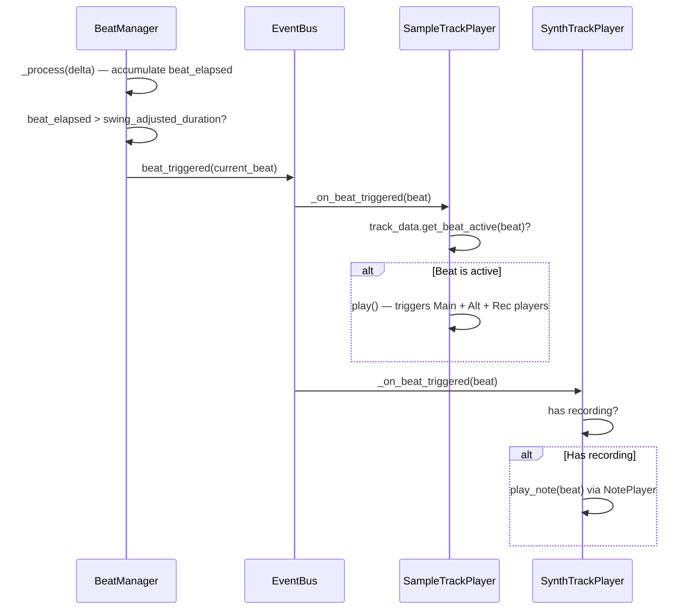
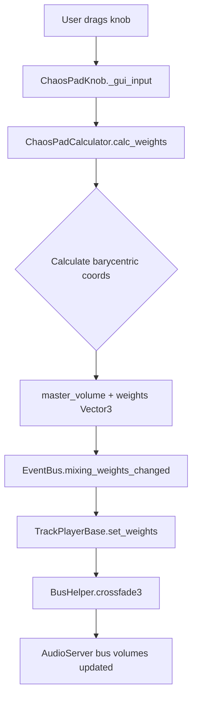
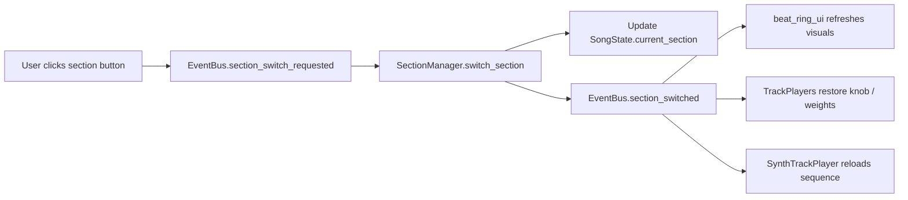
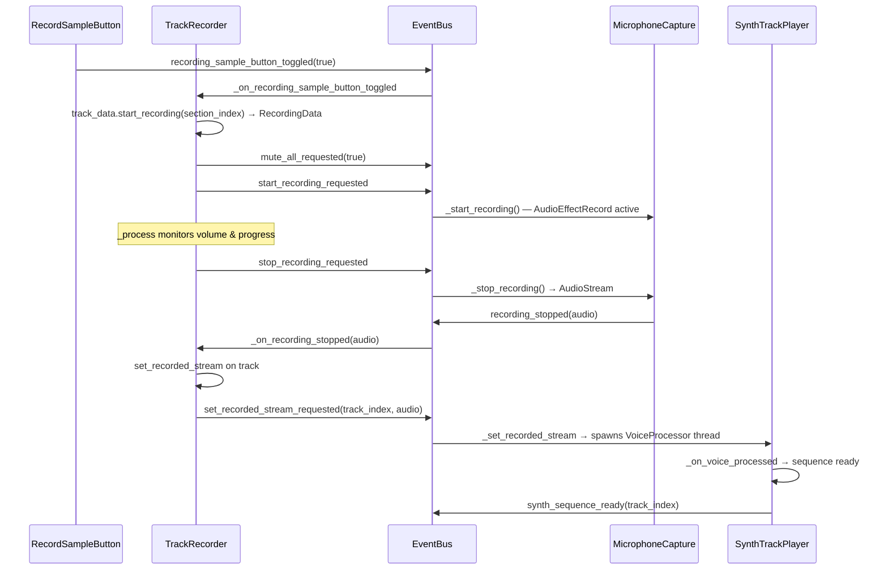
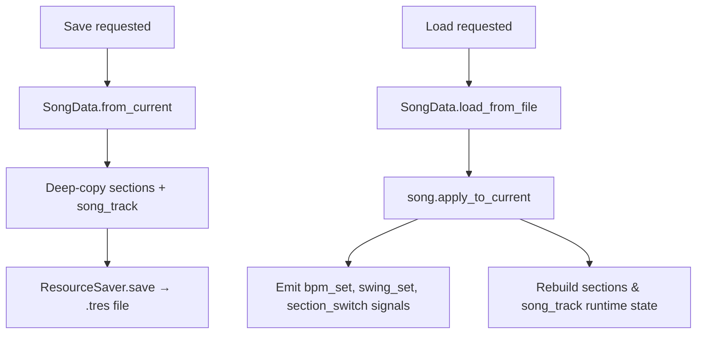

# 🏗️ YouBeatAI Architecture

## 🎯 Design Philosophy

YouBeatAI (also known as "Ritme Robot") is a Godot 4.6 music-creation app where users build beats, record audio samples, and compose songs using a visual beat-ring interface and an AI-powered "Klappy" robot companion.

The project follows a **pure event-driven architecture** where:

1. **No direct coupling** between managers — they never reference each other
2. All inter-system communication flows through the `EventBus` autoload (signals)
3. Persistent song state lives in `SongState`; playback / runtime state lives in `GameState`
4. Data classes extend `Resource` so the entire song tree is serializable
5. Managers are independently testable

---

## 📦 Project Structure

```
project root
├── Scripts/
│   ├── Global/           # Autoload singletons (EventBus, GameState, SongState, TTSHelper)
│   ├── Managers/         # Core game logic (BeatManager, SectionManager, GameManager, …)
│   ├── Audio/            # Audio playback, recording, bus helpers
│   │   ├── AudioBanks/       # AudioBank & EffectProfile resources
│   │   └── AudioPlayerClasses/  # TrackPlayerBase, SampleTrackPlayer, SynthTrackPlayer, …
│   ├── DataClasses/      # Pure data resources (SongData, SectionData, TrackData, …)
│   ├── UI/               # Visual controllers, button scripts
│   │   └── Buttons/          # Individual button scripts
│   ├── ChaosPad/         # Chaos pad mixer logic (calculator, knob, triangle container)
│   ├── Klappy/           # Robot companion scripts (reactions, speech bubbles)
│   ├── Achievements/     # Tutorial / achievement system
│   ├── TrackSettingsRes/ # Per-track-type settings resources & registry
│   └── soundfont/        # Voice processing, Sequence, SequenceNote, NotePlayer
├── Scenes/
│   ├── main.tscn             # Main application scene
│   ├── main_menu.tscn        # Soundbank selection / start screen
│   ├── soundbank.tscn        # Soundbank browser
│   ├── loading.tscn          # Loading screen
│   ├── Prefab/               # Reusable scene prefabs (BeatButton, SectionButton)
│   ├── UI_Components/        # UI component scenes (chaos pad, settings, prompts, …)
│   ├── Klappy_components/    # Robot model & animation scenes
│   ├── OLD/                  # Legacy scenes (to be cleaned up)
│   └── Work_in_progress_scenes/  # ⚠️ Will be deleted
├── Experimental/         # ⚠️ Prototype code — most will be deleted
│   ├── Klappy/               # Early robot model experiments
│   ├── SongExport/           # Export experiments
│   ├── VoiceToSynth/         # Voice-to-synth prototypes
│   ├── chords/               # Chord progression experiments
│   └── sequencer/            # Sequencer experiments
├── Resources/            # Audio files, soundfonts, templates, textures, icons
├── Data/                 # JSON data files (tutorial steps)
├── fft/                  # FFT addon (spectrum analysis)
├── addons/               # Editor plugins (csv-data-importer, synth, beat_buttons_inspector, soundfont)
├── Themes/               # UI theme resources
├── Shaders/              # Custom shaders
└── tests/                # Test scenes
```

> **Note:** `Scenes/Work_in_progress_scenes/` will be deleted. Most code under `Experimental/` is prototype work and will also be removed. Do not depend on or reference anything in those directories.

---

## 🔄 Autoloads

Defined in `project.godot` under `[autoload]`:

| Singleton | Path | Purpose |
|-----------|------|---------|
| `FFT` | `fft/Fft.gd` | Fast Fourier Transform utility for spectrum analysis |
| `EventBus` | `Scripts/Global/event_bus.gd` | Central signal hub — all inter-system communication |
| `GameState` | `Scripts/Global/game_state.gd` | Runtime playback state (playing, current_beat, settings) |
| `SongState` | `Scripts/Global/song_state.gd` | Persistent song state — adapter over a live `SongData` instance |

### GameState vs SongState

- **GameState** holds runtime / playback state: `playing`, `current_beat`, `beat_progress`, `beat_duration`, `is_recording`, `microphone_volume`, audio player references, and user settings (clap_bias, metronome, etc.)
- **SongState** holds the song model. It wraps a `SongData` resource instance (`SongState.data`) and delegates persistent properties (sections, bpm, total_beats, swing, song_track) to it via getters/setters. Runtime-only state like `current_section`, `selected_track_index`, and `selected_soundbank` lives directly on `SongState`.

---

## 📊 System Flowcharts

### Beat Playback Flow



### Chaos Pad Mixing Flow



### Section Switching Flow



### Recording Flow



### Save / Load Flow



---

## 🔌 Manager Reference

### Core Systems

| Manager | Responsibility | Key Signals |
|---------|---------------|-------------|
| `beat_manager.gd` | Master clock + sequencer logic, BPM, swing, beat toggling | Emits: `beat_triggered`, `bpm_changed`, `beat_state_changed`. Listens: `bpm_up/down/set_requested`, `play_pause_toggle_requested`, `beat_sprite_clicked`, `template_set` |
| `section_manager.gd` | Section CRUD, copy/paste, clear, switching | Emits: `section_switched`, `section_added`, `section_removed`, `section_cleared`. Listens: `section_switch_requested`, `add_section_requested`, `copy/paste_requested` |
| `audio_player_manager.gd` | Creates and manages TrackPlayers (4 sample + 2 synth + 1 song), SFX playback | Listens: `play_sfx_requested` |
| `game_manager.gd` | Top-level scene setup, fullscreen toggle, TTS, time tracking | Listens: `fullscreen_toggle_requested` |
| `keyboard_input_manager.gd` | Keyboard shortcuts → EventBus signals | Emits: `bpm_up/down_requested`, `play_pause_toggle_requested`, `ring_key_pressed`, etc. |
| `template_manager.gd` | Beat template loading & application from text files | Listens: `template_set_requested`. Emits: `template_set` |
| `sound_bank_selector.gd` | Soundbank matching by themes + emotions | Listens: `audio_bank_selected` |
| `sound_bank_loader.gd` | Loads AudioBank resources & applies BPM/swing/settings | Emits: `audio_bank_loaded` |

### Audio Player Hierarchy

```
TrackPlayerBase (abstract)
├── SampleTrackPlayer  — 4 instances (kick, clap, snare, hi-hat)
│   └── 3 sub-players: Main, Alt, Rec (each on its own bus)
├── SynthTrackPlayer   — 2 instances (voice-to-synth tracks)
│   └── 3 sub-players: Alt, NotePlayer, Recording
└── SongTrackPlayer    — 1 instance (full-song voice-over + master recording)
```

### Audio Bus Architecture

```
Master Bus
├── Sample0 (Kick)
│   ├── Sample0_Main
│   ├── Sample0_Alt
│   └── Sample0_Rec
├── Sample1 (Clap)
│   └── …
├── Sample2 (Snare)
│   └── …
├── Sample3 (Hi-hat)
│   └── …
├── Synth4
│   ├── Synth4_Alt
│   ├── Synth4_NotePlayer
│   └── Synth4_Recording
├── Synth5
│   └── …
├── Song6 (full-song track)
└── Microphone Bus (input + spectrum analyzer + recording effect)
```

Buses are created dynamically at runtime by each `TrackPlayerBase.setup()` via `BusHelper.create_bus()`.

---

## 📐 Data Model

### Class Hierarchy

```
Resource
├── SongData            — Top-level song: sections[], bpm, swing, song_track, metadata
├── SectionData         — One section: tracks[] (4 sample + 2 synth), emoji, index
├── TrackData (base)    — knob_position, master_volume, weights, recorded_audio_stream
│   ├── SampleTrackData — beats[] (bool array), main/alt audio streams
│   ├── SynthTrackData  — sequence_notes[], _sequence (runtime Sequence)
│   └── SongTrackData   — master_recording_stream, recording_length
├── AudioBank           — Soundbank: kick/clap/snare/closed streams + synth settings
├── EffectProfile       — Per-track audio effect chain
├── NotePlayerSettings  — Synth instrument configuration
└── TemplateData        — Beat template definition

RefCounted
└── RecordingData       — Recording state machine + lazy-cached PCM/FFT analysis

Node
└── Sequence            — Beat-mapped note list from VoiceProcessor
    └── SequenceNote (Resource) — note, duration, beat, velocity, chord
```

### Serialization

The entire song state is serializable via Godot's Resource system:
- `SongData.from_current()` creates a deep-copy snapshot of the live state
- `ResourceSaver.save(song, path)` writes to `.tres`
- `SongData.load_from_file(path)` loads and `apply_to_current()` restores into live autoloads

Since `SectionData → TrackData → AudioStreamWAV` are all Resources, Godot serializes the full tree including recorded audio samples.

---

## 📁 File Organization Principles

1. **Global/** = Autoload singletons only (`EventBus`, `GameState`, `SongState`, `TTSHelper`)
2. **Managers/** = Game logic nodes (no UI references, communicate via EventBus)
3. **Audio/** = Audio playback, recording, bus management, microphone
4. **DataClasses/** = Pure data resources (no scene tree dependencies)
5. **UI/** = Visual controllers (read state from singletons, emit signals to request changes)
6. **ChaosPad/** = Isolated mixing calculator and knob logic
7. **Klappy/** = Robot companion behavior (reactions, speech)
8. **soundfont/** = Voice-to-synth pipeline (VoiceProcessor, Sequence, NotePlayer)

---

## 🧩 Adding a New Feature

Example: **Add a "Shuffle Section" button**

### 1. Add EventBus Signal
```gdscript
# Scripts/Global/event_bus.gd
## Emitted to request shuffling the current section's beats randomly.
signal section_shuffle_requested()
```

### 2. Create UI Button
```gdscript
# Scripts/UI/shuffle_button.gd
extends Button

func _pressed() -> void:
    EventBus.section_shuffle_requested.emit()
```

### 3. Handle in Manager
```gdscript
# Scripts/Managers/section_manager.gd
func _ready() -> void:
    EventBus.section_shuffle_requested.connect(_shuffle_current_section)

func _shuffle_current_section() -> void:
    for track in range(SectionData.SAMPLE_TRACKS_PER_SECTION):
        for beat in range(SongState.total_beats):
            current_section.set_beat(track, beat, randf() > 0.5)
    EventBus.section_switched.emit(current_section)  # Notify UI to refresh
```

### 4. Test
```gdscript
# tests/test_section_shuffle.gd
func test_shuffle_changes_beats():
    var original = current_section.get_beat_actives()
    EventBus.section_shuffle_requested.emit()
    await get_tree().process_frame
    assert_ne(current_section.get_beat_actives(), original)
```

---

## 🚨 Common Pitfalls

| ❌ Don't | ✅ Do |
|----------|------|
| `get_node("%Manager").do_thing()` | `EventBus.thing_requested.emit()` |
| Store state in UI nodes | Store in `GameState`, `SongState`, or data classes |
| Use `await get_tree().process_frame` in managers | Use signals for async flow |
| Hardcode paths: `load("res://...")` | Use `@export var resource: Resource` |
| Add new signals outside EventBus | Define all signals in `event_bus.gd` |
| Reference managers from other managers | Communicate exclusively through EventBus |
| Put runtime-only fields in `SongData` | Runtime state goes on `SongState` (not serialized) |
| Modify `SongState.data` directly for settings changes | Emit `bpm_set_requested` / `swing_set_requested` etc. so managers stay in sync |

---

**See Also:**
- [STYLE_GUIDE.md](STYLE_GUIDE.md) — Code conventions and naming rules
- [README.md](README.md) — Project overview